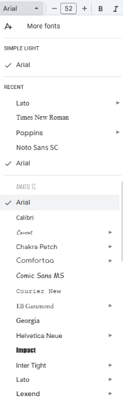

# MCTS split Menu

# The original repo of this project : https://github.com/aalto-ui/chi21adaptive

This an extension version of Adaptive Menu, with a focus on adapting the split menu.

My work focused on redesigning the rewards in Deep reinforcement learning to make the whole system work on the split menu specifically.

What is a split menu:



### What I have changed:
Files in MCTS - rewards design and Monte Carlo tree search

### What remains as the original repo:
Files in value_network - trained Neural network


# Original Repo:

Project for the MCTS of menu adaptions.

[Read the Value Network documentation in a dedicated folder.](./value_network/README.md)

## Contributors

In alphabetical order:

* Antti Oulasvirta
* Gilles Baily
* Kashyap Todi
* Luis A. Leiva

## Requirments

1. Parallel Python (PP): To install for Python3, navigate to the `pp-1.6.4.4` directory, and run `pip3 install`. 
2. TensorFlow 2 (https://www.tensorflow.org/install/pip) for using the Value Network

## Key Components for MCTS

* `plan.py` is the starting point for code execution. To generate results, execute:

```python3 plan.py -c 5items --nonn```
The command will run the MCTS planner for the 5 item case (menu_5items.txt) without the value network. To include the value network, remove the `--nonn` option.

* `utility.py` contains useful functions for loading data, initialisation, etc.

* Input files are stored within `Input` folder. For each case, there's an input menu, association list, and user history.

* `state.py` defines the menu and user state. The root state is initialised using the input menu, associations, and user history

* `adaptation.py` provides a general format for defining adaptations. It uses the syntax `(i,j,type,expose)` where `i` and `j` are two positions in the menu, `type` specifies the type of adaptation (e.g. swap, move, group move), and `expose` is a boolean that specifies whether the adapted menu is exposed to the user or not.

* `mcts.py` contains the entire code for running the Monte Carlo tree search.

* `useroracle.py` defines the user models for running simulations. These models are used towards predicting task completion time given a menu design, and for computing the reward after making an adaptation.

