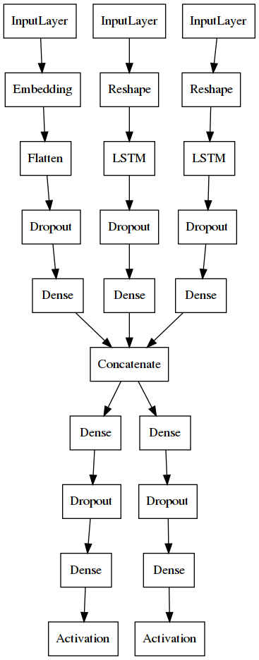

# Value Network for MCTS Menu

This document explains the model design of the value network, how to train it, and how to use it to predict new menu adaptations.

**Note:** It is highly recommended to use a Python environment, to ensure that we use the right software dependencies and their versions.
I used pipenv, so there should be a `Pipfile` in each directory with runnable code.
You can also use Conda, virtualenv, or any other Python environment.

The goal of the value network is to provide fast predictions about a given menu adaptation.
According to my own benchmarks, the trained model can provide around 1000 predictions per second when running on a GPU.

## Model Design

The value network is implemented as an artificial neural network with three heads and two tails.

**Input:** The model receives a batch of adaptation instances, defined as (1) the adapted menu configuration, (2) the difference of click distributions w.r.t. the previous menu configuration, and (3) the difference of matrix association. *An adaptation instance can have up to 20 menu items.*

Notice that the *user input* does not follow this format. Instead, the user has to provide the current menu configuration (elements, click distribution, and association matrix) and the adapted menu configuration (elements, click distribution, and association matrix), and the `ValueNetwork` class will automatically format the required input to the model. See [Use](#use) section below.



The adapted menu configuration is modeled by an Embedding layer, whereas the click distributions and matrix association are both modeled by LSTM layers. Dropout layers are added before each head input for regularization, aimed at making the model more generalizable.

**Output:** The model outputs a list with two float values: goodness score and adaptation cost.
The policy network should use this info to decide which nodes to explore in the MCTS.

## Train

First generate some training data with the "pump" program.
It will create a `results.txt` file with all the menu adaptation instances.
Each line in that file must follow the following format:
`[score,cost][source_menu][source_frequencies][source_associations][target_menu][target_frequencies][target_associations]`.

I edited `pump.py` and set the following pump controls:
```python
number_of_unique_menus = 50
number_of_adaptations = 50
timeBudget = 1000
maxdepth = 10
```
Then I ran this in the terminal:
```sh
[pipenv run] python3 pump.py
```
which generated a `results.txt` file with 1623 menu instances.

Then I trained the model by running this:
```sh
[pipenv run] python3 train.py /path/to/results.txt
```

After training, you will see a h5 file. This is the model you have to use for inference.

**Note:** If you use pipenv, the current `Pipfile` specifies `tensorflow ~= 2.0` but if you have a GPU then install `tensorflow-gpu ~= 2.0` instead to speed up training.

## Use

This is the minimal working example to use the model for inference:
```python
from model import ValueNetwork

vn = ValueNetwork('model.h5')

# Then, at some point in MCTS, predict some samples.
(scores, costs) = vn.predict_batch(samples)
```
where `model.h5` is the trained model file and `samples` is a collection of adaptation instances.

An adaptation instance is a list with 6 items:

- `source_menu` (list): Source menu configuration.
- `source_frequencies` (list): Click frequency over source menu items.
- `source_associations` (list): Association matrix between source menu items.
- `target_menu` (list): Target menu configuration.
- `target_frequencies` (list): Click frequency over target menu items.
- `target_associations` (list): Association matrix between target menu items.
